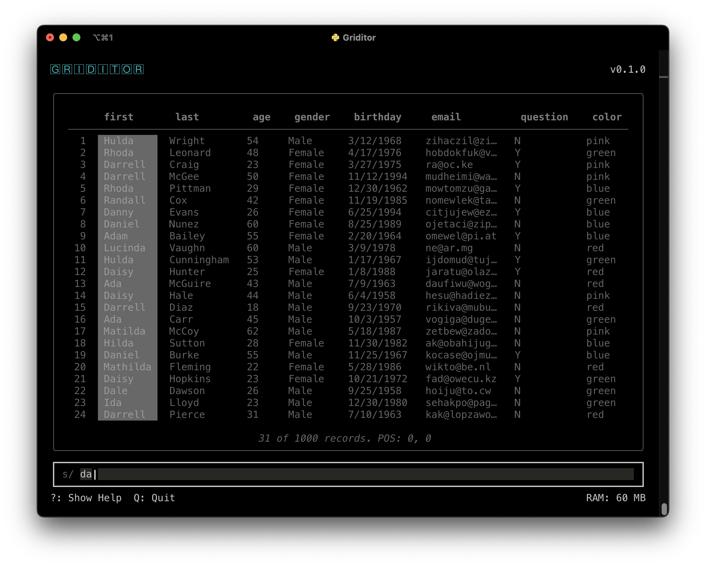

# Griditor

Command-line based 2d data editing tool written in Python.

## Keyboard Commands
- **Q**: Quit
- **→**: Next  *Select next column to the right*
- **←**: Previous. *Exactly the same thing backwards*
- **↓**: Down. *Scroll grid down 1 line*
- **↑**: Up. *You're getting the hang of this*
- **X**: Shuffle. *Shuffle all rows*
- **S**: Sort. *Sort ascending by currently selected column*
- **W**: Sort. *Sort descending by currently selected column*
- **C**: Clean. *Remove all rows where the selected column is empty*
